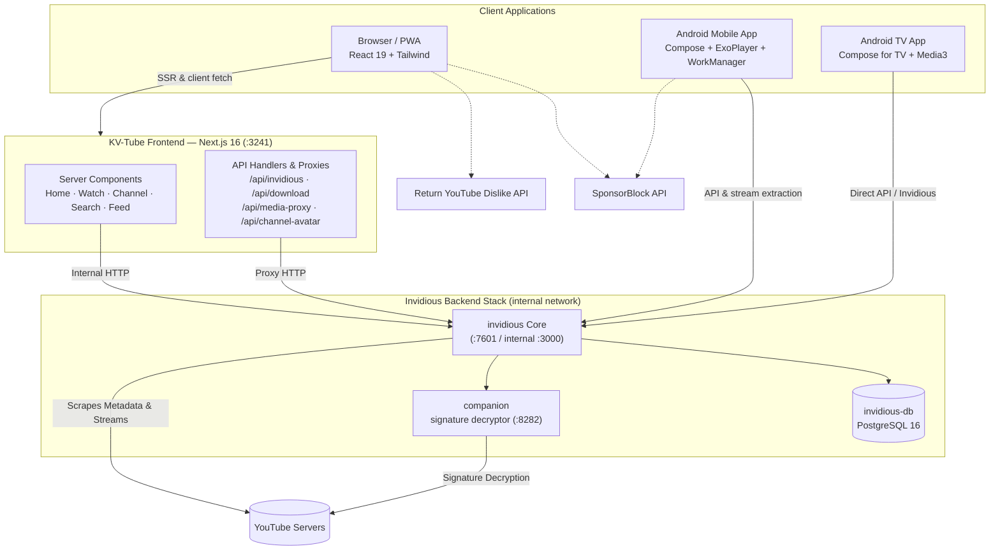

<h1 align="center">🎬 KV-Tube</h1>

<p align="center">
  <strong>Your own private YouTube — self-hosted, ad-free, private.</strong><br/>
  <sub>Runs on your NAS or home server · Watch in any browser · No tracking</sub>
</p>

<p align="center">
  <a href="https://github.com/vndangkhoa/kv-tube/blob/main/LICENSE">
    
  </a>
  
  
  
  
  
  
  
</p>

<p align="center">
  🌐 <b>Language / Ngôn ngữ:</b>
  <a href="#-what-is-kv-tube"><b>🇬🇧 English</b></a> •
  <a href="#tieng-viet"><b>🇻🇳 Tiếng Việt</b></a>
</p>

---

# 🇬🇧 English

**On this page:** [What is KV-Tube?](#-what-is-kv-tube) • [Features](#-features) • [Quick Start](#-quick-start) • [Synology NAS](#-setting-up-on-a-synology-nas) • [How It Works](#%EF%B8%8F-how-it-works-architecture) • [Data Flow](#-data-flow) • [Other Deployments](#-other-ways-to-deploy) • [Configuration](#%EF%B8%8F-configuration) • [Apps](#-mobile--tv-apps) • [Developers](#-for-developers)

---

## 📖 What is KV-Tube?

KV-Tube is a website **you host yourself** that looks and works like YouTube — but without ads, without tracking, and under your control.

With KV-Tube you can:

- 🔍 **Search & watch** any YouTube video
- 🔔 **Subscribe** to channels and get your own feed
- 🚫 **Skip ads & sponsors automatically** (built-in SponsorBlock)
- 📜 **Save watch history** on *your* server — not Google's
- 📱 Watch on **phone, TV, tablet** via apps or browser
- 🎵 Listen in the **background** with screen locked

> 💡 In short: think *"Netflix-style YouTube front page, running at home"*.

---

## ✨ Features

| | Feature | What it means for you |
|---|---------|----------------------|
| 🎞️ | **Adaptive playback** | Quality from 144p up to 4K, playback speed, subtitles |
| 🔔 | **Subscriptions & channels** | Follow any channel, rich channel pages, infinite feed |
| 🔍 | **Fast search** | Search videos, channels and playlists with filters |
| 📜 | **Watch history** | Resume where you left off, on every device |
| 🚫 | **No ads & no sponsors** | SponsorBlock segments skipped, dislike counts shown (RYD) |
| 🎵 | **Background audio + PWA** | Keep listening when the screen is off, installable as an app |
| 🌓 | **Dark / Light / System theme** | Trending region selectable per user |
| 📥 | **Downloads** | Save videos as MP4 — Low (≤360p), Recommended (≤1080p), Best |
| 🔐 | **Invidious account sync** | Sync subscriptions, feed and history across devices |
| 📱 | **Native Android app** | Kotlin + Material 3, offline downloads, auto-update |
| 📺 | **Native Android TV app** | Remote-friendly UI (D-pad), HLS/DASH playback |

<details>
<summary>🖼️ See all features in detail (click to expand)</summary>

- **Adaptive Video Playback** — HLS and DASH streaming with adaptive quality selector, variable playback speeds and subtitle support.
- **Watch History & Feed** — Automatically tracked history and a personalized feed, always in sync.
- **Subscriptions & Channels** — Channel pages with banners, avatars, subscriber counts and infinite-scrolling video lists.
- **Full-Text Search** — Fast search across videos, channels and playlists with category filter chips.
- **Background Audio & PWA** — Installable PWA with full-screen experience and offline UI caching.
- **Themes & Region Tuning** — Dark, Light and System themes; trending region per user (persisted in cookie).
- **Comments & Engagement** — Real YouTube comments, like/dislike counts via Return YouTube Dislike, automatic segment skipping powered by SponsorBlock.
- **Server & Client Downloads** — MP4 downloads with live progress and 3 quality tiers.
- **Invidious Account Sync** — Sync subscriptions, feed and watch history across devices, with import/export support.
- **Fast & Self-cleaning** — Stream signature decryption via companion, aggressive caching, multi-client fallback, automated temp-file purging.

</details>

---

## 🚀 Quick Start

One recipe file + one command. That's it.

```bash
mkdir -p kv-tube && cd kv-tube
curl -O https://raw.githubusercontent.com/vndangkhoa/kv-tube/main/docker-compose.yml
docker compose up -d
```

Then open:

| What | Address |
|------|---------|
| 🎬 **KV-Tube (the website)** | http://localhost:3241 |
| 🔌 Invidious API (backend) | http://localhost:7601 |

> ⚠️ **Watching from another device** (phone, laptop)? Edit `NEXT_PUBLIC_INVIDIOUS_URL` in `docker-compose.yml` and replace `127.0.0.1` with your server's IP, e.g. `http://192.168.1.10:7601`, then run `docker compose up -d` again.

This starts **4 containers** that work together (explained below in [How It Works](#%EF%B8%8F-how-it-works-architecture)).

---

## 🖥️ Setting Up on a Synology NAS

Using a Synology NAS? Two options:

| Option | Best for | Guide |
|--------|----------|-------|
| 👶 **Beginner guide** | First time with Docker, GUI only, no terminal | **[README-SYNOLOGY.md](README-SYNOLOGY.md)** *(bilingual EN/VI)* |
| 🛠️ Full guide | Comfortable with SSH, wants HTTPS/reverse proxy, troubleshooting | [Main deployment section](#-other-ways-to-deploy) below |

Quick version for DSM 7.2+:

1. Install **Container Manager** from Package Center
2. Create folder `/docker/kv-tube` in File Station, put [`docker-compose.yml`](docker-compose.yml) inside
3. Container Manager → **Project** → **Create** → point to that folder
4. Open `http://NAS-IP:3241` 🎉

*(Prefer a native Package Center app? Try the community [KV-Tube SPK package](https://github.com/vndangkhoa/synology-spk).)*

---

## 🏗️ How It Works (Architecture)

KV-Tube is not one big program. It's **4 small containers cooperating**:

| Container | Plain words | Port |
|-----------|-------------|------|
| **kv-tube-ui** | The website you watch on (Next.js) | `3241` |
| **invidious** | The middleman that talks to YouTube for you (no ads/tracking) | `7601` |
| **invidious-db** | A small database remembering channels, playlists, tokens | internal |
| **companion** | Helper that unlocks the real video streams | internal |

*(A legacy **all-in-one Go backend** also exists for single-container setups — see [Other Ways to Deploy](#-other-ways-to-deploy).)*

### 🔀 Data Flow



**Reading the diagram, simply:**

1. Your device asks **kv-tube-ui** (the website) for a video
2. kv-tube-ui asks **invidious** behind the scenes
3. invidious fetches metadata from **YouTube**, decrypting stream signatures via **companion**
4. Video plays on your device — ads and tracking never enter the picture

---

## 📦 Other Ways to Deploy

### Classic All-in-One (single container)

Prefer everything inside one container (Go/Gin backend + Next.js + yt-dlp)? No Invidious needed:

```bash
git clone https://github.com/vndangkhoa/kv-tube.git
cd kv-tube
docker build -t kv-tube:latest .
docker run -d -p 3241:3000 -p 8080:8080 -v ./data:/app/data kv-tube:latest
```

### Pre-built Images

| Image | Contents | Use it for |
|-------|----------|------------|
| `kv-tube-ui` (~485 MB) | Next.js frontend only | The recommended 4-container stack (`docker-compose.yml`) |
| `kv-tube` (~1.1 GB) | Frontend + Go backend + yt-dlp + ffmpeg | Classic all-in-one mode |

Available on **Docker Hub** (`vndangkhoa/kv-tube[-ui]:latest`), **GHCR** (`ghcr.io/vndangkhoa/...`) and **Forgejo** (`git.khoavo.myds.me/vndangkhoa/...`).

### Source Repositories

- **GitHub:** [https://github.com/vndangkhoa/kv-tube](https://github.com/vndangkhoa/kv-tube)
- **Forgejo:** [https://git.khoavo.myds.me/vndangkhoa/kv-tube](https://git.khoavo.myds.me/vndangkhoa/kv-tube)

---

## ⚙️ Configuration

Most people don't need to change anything. Common tweaks go in `docker-compose.yml`.

### Frontend (`kv-tube` service / `frontend/.env`)

| Variable | Default | Meaning |
|----------|---------|---------|
| `INVIDIOUS_URL` | `http://invidious:3000` | Internal address between containers — leave as-is |
| `NEXT_PUBLIC_INVIDIOUS_URL` | `http://127.0.0.1:7601` | Where browsers find Invidious. **Change `127.0.0.1` to your server IP** for other devices to work |
| `INVIDIOUS_TOKEN` / `NEXT_PUBLIC_INVIDIOUS_TOKEN` | *empty* | Optional session token for private feeds/history sync |
| `NEXT_PUBLIC_SITE_URL` | `https://youtube.khoavo.myds.me` | Public site URL (used for share previews) |
| `NEXT_PUBLIC_SPONSORBLOCK_URL` | `https://sponsor.ajay.app` | SponsorBlock API endpoint |
| `NEXT_PUBLIC_RYD_URL` | `https://returnyoutubedislikeapi.com` | Return YouTube Dislike API endpoint |

> Trending region defaults to `VN`; each user can change it in-app (saved in a cookie).

### Legacy Go Backend (`backend/.env`) — all-in-one mode only

| Variable | Default | Meaning |
|----------|---------|---------|
| `PORT` | `8080` | Backend listening port |
| `KVTUBE_DATA_DIR` | `./data` | SQLite database + cache folder |
| `GIN_MODE` | `release` | `release` or `debug` |
| `CORS_ALLOWED_ORIGINS` | `http://localhost:3000,...` | Allowed origins, comma-separated, or `*` |
| `RATE_LIMIT_RATE` / `_INTERVAL` / `_BURST` | `300` / `1m` / `120` | Per-IP rate limiting |
| `YTDLP_PROXY` | *empty* | Optional HTTP/SOCKS5 proxy for yt-dlp |
| `YTDLP_COOKIES` | *empty* | Path to `cookies.txt` (needed for comments, bypasses bot-check) |
| `FORCE_IPV6` | *unset* | `1` force IPv6, `0` disable, unset = auto-probe |
| `YTDLP_AUTO_UPDATE` | `true` | Auto-update yt-dlp daily |

---

## 📱 Mobile & TV Apps

Two native Android apps are included (Kotlin + Jetpack Compose):

| App | Highlights | Compatibility |
|-----|------------|---------------|
| 📲 **Phone/Tablet** ([`android-app/`](android-app)) | Material 3, background audio, on-device MP4 downloads (NewPipeExtractor + WorkManager), download manager, auto-update | Android 5.0+ |
| 📺 **Android TV** ([`android-tv/`](android-tv)) | Compose for TV, D-pad remote navigation, HLS/DASH playback, connects to your Invidious instance | Android 7.0+ |

Build them yourself:

```bash
cd android-app && ./gradlew assembleDebug          # phone APK
cd android-tv  && ./gradlew :app:assembleDebug     # TV APK
adb install -r app/build/outputs/apk/debug/app-debug.apk
```

---

## 💻 For Developers

```bash
./launch.sh dev      # frontend + backend with hot reload
./launch.sh prod     # production mode
./stop.sh            # stop everything
```

Manual:

```bash
cd frontend && npm install && npm run dev   # Next.js on :3000
cd backend && go run main.go                # Go backend on :8080
```

---

## 💖 Support the Project

KV-Tube is free, open source and ad-free. If it saves you from ads, consider supporting development:

<p align="center">
  
</p>

<p align="center">Every contribution helps keep the servers running. Thank you! ❤️</p>

---

## 🤝 Contributing

Contributions are always welcome!

1. Fork the repository
2. Create a branch (`git checkout -b feature/amazing-feature`)
3. Commit changes (`git commit -m 'feat: add amazing feature'`)
4. Push (`git push origin feature/amazing-feature`)
5. Open a Pull Request

## 📄 License

Distributed under the **MIT License**. See [`LICENSE`](LICENSE).

---
---

# 🇻🇳 Tiếng Việt

<h2 align="center" id="tieng-viet">📖 KV-Tube là gì?</h2>

KV-Tube là một trang web **bạn tự lưu trữ** — nhìn và dùng giống YouTube nhưng không quảng cáo, không theo dõi, và nằm dưới sự kiểm soát của bạn.

Với KV-Tube bạn có thể:

- 🔍 **Tìm & xem** bất kỳ video YouTube nào
- 🔔 **Đăng ký kênh** và có bảng tin riêng
- 🚫 **Tự động bỏ quảng cáo & phân đoạn tài trợ** (tích hợp SponsorBlock)
- 📜 **Lưu lịch sử xem** trên máy chủ *của bạn* — không phải của Google
- 📱 Xem trên **điện thoại, TV, tablet** qua ứng dụng hoặc trình duyệt
- 🎵 Nghe **nhạc nền** khi khóa màn hình

> 💡 Tóm gọn: hãy nghĩ *"trang YouTube phong cách Netflix, chạy ngay tại nhà"*.

---

## ✨ Tính năng

| | Tính năng | Lợi ích cho bạn |
|---|-----------|-----------------|
| 🎞️ | **Phát video thích ứng** | Chất lượng từ 144p đến 4K, đổi tốc độ phát, phụ đề |
| 🔔 | **Đăng ký kênh & trang kênh** | Theo dõi mọi kênh, feed cuộn vô hạn |
| 🔍 | **Tìm kiếm nhanh** | Tìm video, kênh, playlist kèm bộ lọc |
| 📜 | **Lịch sử xem** | Tiếp tục nơi bạn đã dừng, trên mọi thiết bị |
| 🚫 | **Không quảng cáo & sponsor** | Tự bỏ phân đoạn SponsorBlock, hiện số dislike (RYD) |
| 🎵 | **Nhạc nền + PWA** | Nghe tiếp khi tắt màn hình, cài như ứng dụng |
| 🌓 | **Giao diện Tối / Sáng / Hệ thống** | Chọn khu vực thịnh hành theo từng người dùng |
| 📥 | **Tải video** | Lưu MP4 — Thấp (≤360p), Đề xuất (≤1080p), Tốt nhất |
| 🔐 | **Đồng bộ tài khoản Invidious** | Đồng bộ đăng ký kênh, feed, lịch sử giữa các thiết bị |
| 📱 | **Ứng dụng Android gốc** | Kotlin + Material 3, tải offline, tự cập nhật |
| 📺 | **Ứng dụng Android TV gốc** | Giao diện thân thiện remote (D-pad), phát HLS/DASH |

---

## 🚀 Bắt đầu nhanh

Một file công thức + một câu lệnh. Xong.

```bash
mkdir -p kv-tube && cd kv-tube
curl -O https://raw.githubusercontent.com/vndangkhoa/kv-tube/main/docker-compose.yml
docker compose up -d
```

Sau đó mở:

| Cái gì | Địa chỉ |
|--------|---------|
| 🎬 **KV-Tube (trang web)** | http://localhost:3241 |
| 🔌 API Invidious (backend) | http://localhost:7601 |

> ⚠️ **Xem từ thiết bị khác** (điện thoại, laptop)? Sửa `NEXT_PUBLIC_INVIDIOUS_URL` trong `docker-compose.yml`, thay `127.0.0.1` bằng IP máy chủ, ví dụ `http://192.168.1.10:7601`, rồi chạy lại `docker compose up -d`.

Lệnh trên khởi động **4 container** phối hợp với nhau (giải thích ở phần [Kiến trúc](#%EF%B8%8F-how-it-works-architecture)).

---

## 🖥️ Cài đặt trên Synology NAS

Dùng NAS Synology? Có 2 lựa chọn:

| Lựa chọn | Phù hợp với | Hướng dẫn |
|----------|-------------|-----------|
| 👶 **Hướng dẫn cho người mới** | Lần đầu dùng Docker, chỉ cần giao diện, không cần terminal | **[README-SYNOLOGY.md](README-SYNOLOGY.md)** *(song ngữ Anh/Việt)* |
| 🛠️ Hướng dẫn đầy đủ | quen SSH, muốn HTTPS/reverse proxy, xử lý lỗi | [Phần triển khai](#-other-ways-to-deploy) bên dưới |

Bản rút gọn cho DSM 7.2+:

1. Cài **Container Manager** từ Trung tâm gói
2. Tạo thư mục `/docker/kv-tube` trong File Station, đưa [`docker-compose.yml`](docker-compose.yml) vào trong
3. Container Manager → **Project** → **Create** → trỏ tới thư mục đó
4. Mở `http://IP-NAS:3241` 🎉

*(Thích cài như ứng dụng Package Center? Dùng [gói KV-Tube SPK](https://github.com/vndangkhoa/synology-spk) do cộng đồng duy trì.)*

---

## 🏗️ Kiến trúc hoạt động

KV-Tube không phải một chương trình lớn mà là **4 container nhỏ phối hợp**:

| Container | Vai trò | Cổng |
|-----------|---------|------|
| **kv-tube-ui** | Trang web bạn xem video (Next.js) | `3241` |
| **invidious** | "Người môi giới" thay bạn nói chuyện với YouTube (không quảng cáo/theo dõi) | `7601` |
| **invidious-db** | Database nhỏ nhớ kênh, playlist, token | nội bộ |
| **companion** | Trợ giúp mở khóa luồng video thật | nội bộ |

*(Vẫn còn **backend Go all-in-one** cũ cho ai muốn chạy 1 container duy nhất — xem [Các cách triển khai khác](#-other-ways-to-deploy).)*

### 🔀 Luồng dữ liệu (Data Flow)

Xem sơ đồ chi tiết tại [phần tiếng Anh](#-data-flow). Tóm tắt đơn giản:

1. Thiết bị của bạn gửi yêu cầu tới **kv-tube-ui** (trang web)
2. kv-tube-ui hỏi **invidious** phía sau
3. invidious lấy dữ liệu từ **YouTube**, giải mã chữ ký stream qua **companion**
4. Video phát trên thiết bị của bạn — quảng cáo và theo dõi không bao giờ xuất hiện

---

## 📦 Các cách triển khai khác

### All-in-One cổ điển (1 container)

Muốn gói tất cả vào một container duy nhất (backend Go/Gin + Next.js + yt-dlp)? Không cần Invidious:

```bash
git clone https://github.com/vndangkhoa/kv-tube.git
cd kv-tube
docker build -t kv-tube:latest .
docker run -d -p 3241:3000 -p 8080:8080 -v ./data:/app/data kv-tube:latest
```

### Image dựng sẵn

| Image | Nội dung | Dùng cho |
|-------|----------|----------|
| `kv-tube-ui` (~485 MB) | Chỉ frontend Next.js | Stack 4 container được khuyến nghị (`docker-compose.yml`) |
| `kv-tube` (~1.1 GB) | Frontend + backend Go + yt-dlp + ffmpeg | Chế độ all-in-one cổ điển |

Có sẵn trên **Docker Hub** (`vndangkhoa/kv-tube[-ui]:latest`), **GHCR** (`ghcr.io/vndangkhoa/...`) và **Forgejo** (`git.khoavo.myds.me/vndangkhoa/...`).

### Kho mã nguồn

- **GitHub:** [https://github.com/vndangkhoa/kv-tube](https://github.com/vndangkhoa/kv-tube)
- **Forgejo:** [https://git.khoavo.myds.me/vndangkhoa/kv-tube](https://git.khoavo.myds.me/vndangkhoa/kv-tube)

---

## ⚙️ Cấu hình

Phần lớn người dùng không cần sửa gì. Các chỉnh sửa thường gặp nằm trong `docker-compose.yml`.

### Frontend (service `kv-tube` / `frontend/.env`)

| Biến | Mặc định | Ý nghĩa |
|------|----------|---------|
| `INVIDIOUS_URL` | `http://invidious:3000` | Địa chỉ nội bộ giữa các container — giữ nguyên |
| `NEXT_PUBLIC_INVIDIOUS_URL` | `http://127.0.0.1:7601` | Nơi trình duyệt tìm thấy Invidious. **Thay `127.0.0.1` bằng IP máy chủ** để các thiết bị khác dùng được |
| `INVIDIOUS_TOKEN` / `NEXT_PUBLIC_INVIDIOUS_TOKEN` | *trống* | Token phiên (tùy chọn) cho feed/lịch sử riêng tư |
| `NEXT_PUBLIC_SITE_URL` | `https://youtube.khoavo.myds.me` | URL công khai của site (dùng cho preview chia sẻ) |
| `NEXT_PUBLIC_SPONSORBLOCK_URL` | `https://sponsor.ajay.app` | Endpoint API SponsorBlock |
| `NEXT_PUBLIC_RYD_URL` | `https://returnyoutubedislikeapi.com` | Endpoint API Return YouTube Dislike |

> Khu vực thịnh hành mặc định là `VN`; mỗi người dùng có thể tự đổi trong ứng dụng (lưu bằng cookie).

### Backend Go cũ (`backend/.env`) — chỉ chế độ all-in-one

| Biến | Mặc định | Ý nghĩa |
|------|----------|---------|
| `PORT` | `8080` | Cổng lắng nghe backend |
| `KVTUBE_DATA_DIR` | `./data` | Thư mục SQLite database + cache |
| `GIN_MODE` | `release` | `release` hoặc `debug` |
| `CORS_ALLOWED_ORIGINS` | `http://localhost:3000,...` | Origin được phép, cách nhau bởi dấu phẩy, hoặc `*` |
| `RATE_LIMIT_RATE` / `_INTERVAL` / `_BURST` | `300` / `1m` / `120` | Giới hạn tốc độ theo IP |
| `YTDLP_PROXY` | *trống* | Proxy HTTP/SOCKS5 tùy chọn cho yt-dlp |
| `YTDLP_COOKIES` | *trống* | Đường dẫn `cookies.txt` (cần cho bình luận, qua màn bot-check) |
| `FORCE_IPV6` | *bỏ trống* | `1` ép IPv6, `0` tắt, bỏ trống = tự dò |
| `YTDLP_AUTO_UPDATE` | `true` | Tự cập nhật yt-dlp hằng ngày |

---

## 📱 Ứng dụng Di động & TV

Hai ứng dụng Android gốc đi kèm (Kotlin + Jetpack Compose):

| Ứng dụng | Điểm nổi bật | Tương thích |
|----------|--------------|-------------|
| 📲 **Điện thoại/Tablet** ([`android-app/`](android-app)) | Material 3, nghe nền, tải MP4 ngay trên thiết bị (NewPipeExtractor + WorkManager), trình quản lý tải, tự cập nhật | Android 5.0+ |
| 📺 **Android TV** ([`android-tv/`](android-tv)) | Compose for TV, điều khiển D-pad, phát HLS/DASH, kết nối Invidious của bạn | Android 7.0+ |

Tự build:

```bash
cd android-app && ./gradlew assembleDebug          # APK điện thoại
cd android-tv  && ./gradlew :app:assembleDebug     # APK TV
adb install -r app/build/outputs/apk/debug/app-debug.apk
```

---

## 💻 Dành cho lập trình viên

```bash
./launch.sh dev      # frontend + backend có hot reload
./launch.sh prod     # chế độ production
./stop.sh            # dừng tất cả
```

Thủ công:

```bash
cd frontend && npm install && npm run dev   # Next.js ở cổng :3000
cd backend && go run main.go                # backend Go ở cổng :8080
```

---

## 💖 Ủng hộ dự án

KV-Tube miễn phí, mã nguồn mở và không quảng cáo. Nếu nó giúp bạn thoát quảng cáo, hãy cân nhắc ủng hộ:

<p align="center">
  
</p>

<p align="center">Mỗi đóng góp giúp duy trì máy chủ hoạt động. Cảm ơn bạn! ❤️</p>

---

## 🤝 Đóng góp

Mọi đóng góp đều được chào đón!

1. Fork repository
2. Tạo nhánh mới (`git checkout -b feature/amazing-feature`)
3. Commit (`git commit -m 'feat: add amazing feature'`)
4. Push (`git push origin feature/amazing-feature`)
5. Mở Pull Request

## 📄 Giấy phép

Phân phối theo **Giấy phép MIT**. Xem [`LICENSE`](LICENSE).

---

<p align="center">
  <sub>Nếu dự án hữu ích, hãy <a href="https://github.com/vndangkhoa/kv-tube">⭐ star trên GitHub</a> nhé!</sub><br/>
  <sub>Xây dựng với ❤️ bởi <a href="https://github.com/vndangkhoa">Khoa Vo</a></sub>
</p>
